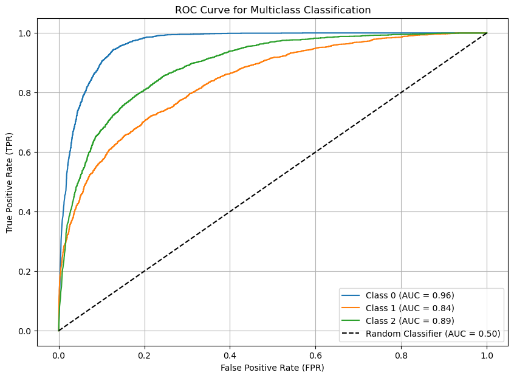
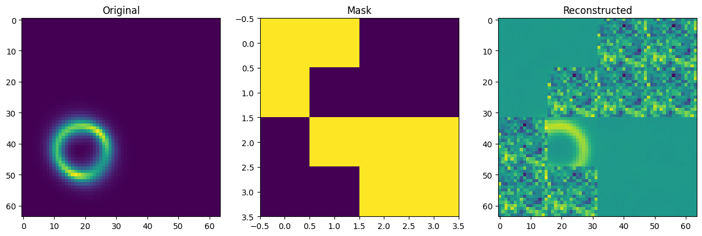
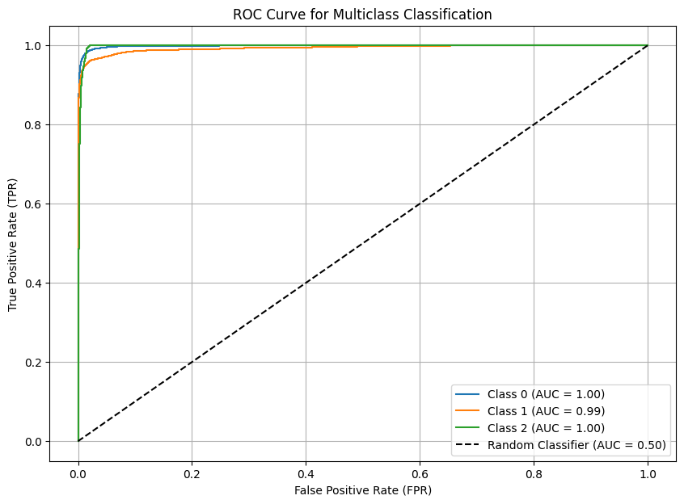
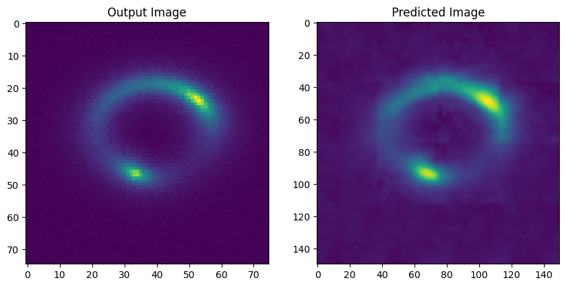

# Gravitational Deep Lense

Strong gravitational lensing is a powerful tool for studying dark matter and the large-scale structure of the universe. This project focuses on developing a vision foundation model specifically designed for lensing data, which can be fine-tuned for a variety of downstream tasks, including classification, super-resolution, regression, and lens finding.

This project will explore different training strategies such as self-supervised learning, contrastive learning, or transformer-based models to learn meaningful representations of lensing images. By leveraging diverse datasets and training methodologies, the model will serve as a general-purpose backbone that can adapt to different astrophysical tasks while improving generalization across various observational conditions.


## Setting up the Repo

### Setup

#### Cloning the Repository

```bash
git clone https://github.com/MandaKausthubh/GSOC-25-Projects.git
cd GSOC-25-Projects
```

#### Downloading the data

##### Common Task Dataset

```bash
conda install -c conda-forge gdown
gdown "https://drive.google.com/uc?id=1ZEyNMEO43u3qhJAwJeBZxFBEYc_pVYZQ"
unzip -q dataset.zip
rm -fr dataset.zip __MACOSX
mkdir dataset/DatasetTask1
mv dataset/* dataset/DatasetTask1
```

##### Task 6A dataset

```bash
conda install -c conda-forge gdown
gdown "https://drive.google.com/uc?id=1znqUeFzYz-DeAE3dYXD17qoMPK82Whji"
unzip -q Dataset.zip
rm -fr Dataset.zip __MACOSX
mkdir dataset
mv Dataset dataset/
mv dataset/Dataset dataset/DatasetTask6A
mv dataset/
```

##### Task 6B dataset

```bash
conda install -c conda-forge gdown
gdown "https://drive.google.com/uc?id=1uJmDZw649XS-r-dYs9WD-OPwF_TIroVw"
unzip -q Dataset.zip
rm -fr Dataset.zip __MACOSX
mkdir dataset
mv Dataset dataset/
mv dataset/Dataset dataset/DatasetTask6B
mv dataset/
```

#### Setting up of Environment

```bash
conda env create -f environment.yml
conda activate GSOCFoundationalModels
```


## Structure of Repository

```bash
   ./
    |-- dataset/
    |-- Models/
    |-- utils/
    |-- Task-1-Training-and-Results/
    |    |-- Task1Resnet.ipynb
    |
    |-- Task-6-Training-and-Results/
    |    |-- GSOCTasks.ipynb
    |
    |-- dataset/
    |    |
    |    |-- DatasetTask1
    |    |-- DatasetTask6A
    |    |-- DatasetTask6B
```

The final submissions are the files Task1Resnet.ipynb and GSOCTasks.ipynb. The model implementaions can be found in the `Models/` folder and the Training and Dataset implementations can be found in the `utils/` folder. **NOTE: The file corresonding to Task6, *GSOCTasks.ipynb*, was made on Google Colab**. Incase you plan on running it please keep in remove the unnecessary bash commands.

## Tasks, Models and Results

The task submission and specifications can be found in the documentation: `GSoC25_DeepLense_Tests.pdf`. We are given two tasks, a common task, and the second task specific to the Foundational Models.

### Task 1: Multi Class Classification (Common Task)

The first task is common to all Deep Lense projects and the second one is specific to the Foundational Models task. Common Task involves Multi-Class classification on image data, provided on the dataset (link can be found in documentation). For this task we employ a ResNet model, who's implementation can be found in `Models/ResNet.py`. The choice of the model is following the results from the Paper: [Decoding Dark Matter Substructure without Supervision](https://arxiv.org/abs/2008.12731). This implementation achieves an AUC Score of **<span style="color:Green">0.96, 0.84 and 0.89</span>** on the three classes: **No Sub**, **Sphere** and **Vortex** respectively. We obtain these results over training using **Cross Entropy Loss** and **Adam** optimizer. This is done 90 epochs. The detailed results can be found in the attached pictures:



### Task 6: Foundational Model with Masked Auto Encoder

We train a [Masked Auto Encoder (MAE)](https://arxiv.org/abs/2111.06377) to over multiple tasks. The data used here can be found in the document again in the Task 6 section. The implementation of the same can be found in `Models/MaskedAutoEncoders.py`, this implementation is inspired from the original implementation by [FAIR's MAE implementation](https://github.com/facebookresearch/mae).

#### Task 6A: Part 1 :- Pretraining

The model is pre-trained on image reconstruction on the dataset `No sub` images which allow to model to learn basic image representations of the image structures. Here we employ certain modifications to enable efficient learning. One major issue I was running into is the low variablility of data, leading the model to overfitting. We deal with this by employing data-augmentation mechanisms by `torchvision.transforms.RandomAffine`, `torchvision.transforms.RandomHorizontalFlip` and `torchvision.transforms.RandomVerticalFlip`. The prevent Overfitting by can be verified by passing an image consisting of pure-noise and seeing that the output is also gives us random representations, which was not as before (which still gives an image representation representing Overfitting and by-hearting image outputs). We also modify the loss function to include a low-weighted unmasked-patch losses.

This achieves the *MSE Loss* of <span style="color:Green">*0.0021*</span>, through a linear scheduler over 500 epochs and 50% masking. We utilize Adam optimizer and weighted MSE Loss. I must note that the image reconstruction has improved with the loss function, however unmasked patches still seem noisy. However we don't sweat over this as further fine tuning tasks seem good.



#### Task 6A: Part 2 :- Fine Tuning for Classification

The implementation can be found in `Models/MAEClassifier.py`. This implementation uses an MLP layer used over the `[CLS]` token passed through the Encoder of MAE. This gives amazing results as shown in the following picture:



We achieve AUC Score of **<span style="color:Green">1.00, 0.99 and 1.00 </span>** respectively over classes respectively. We achive this by using CrossEntropy with Adam optimizer over 100 epochs.

#### Task 6B:- Super Resolution

This task involves converting low resolution images (75 x 75) to higher resolution images (150 x 150). We use the MAE that has been pre-trained and fine-tuned in task 6a, with a CNN, with linear interpolation based head to convert the (75 x 75) --> (64 x 64) --> (Processed by Encoder + Decoder) --> (150 x 150). This model achieved an *MSE loss* of 0.003, a *PSNR score* of 34.1 and *SSIM* of 0.902. We achieve these results through using Adam optimizer and MSELoss for 100 epochs. The implementation of the same can be found in the file `Models/MAESuperResolution.py`.



## Credits and Acknowledgments

- MAE by FAIR: [link](https://github.com/facebookresearch/mae)
